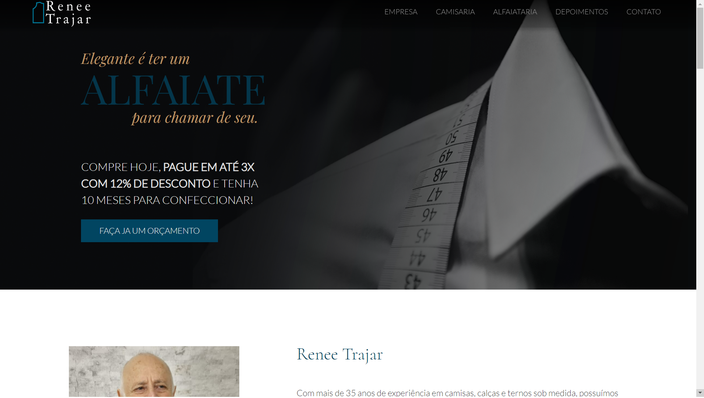

<h1 align="center">Site Renee Trajar</h1>

  <a href="#-Project">Projeto</a>&nbsp;&nbsp;&nbsp;|&nbsp;&nbsp;&nbsp;
  <a href="#-Technologies">Tecnologias</a>&nbsp;&nbsp;&nbsp;|&nbsp;&nbsp;&nbsp;
  <a href="#-Layout">Layout</a>&nbsp;&nbsp;&nbsp;|&nbsp;&nbsp;&nbsp;
  <a href="#-How-to-execute">Como executar</a>&nbsp;&nbsp;&nbsp;|&nbsp;&nbsp;&nbsp;
  <a href="#-Licence">Licença</a>

  

##

## 💻 Projeto

Este site foi desenvolvido em React Js para cumprir o desafio proposto da vaga de desenvolvedor Front End na empresa Fasters.

## ✨ Tecnologias

Este projeto foi desenvolvido com as tecnologias abaixo:

- [React](https://reactjs.org)
- [Sass](https://sass-lang.com)
- [Bootstrap](https://react-bootstrap.github.io/)
## 🔖 Layout

Veja o layout do projeto [neste link](https://www.figma.com/proto/CF2Fe5EiRaWwbThBlEZAMI/Site---Renee-Trajar-NOVO?node-id=104%3A61&viewport=-103%2C-5038%2C1.2973029613494873&scaling=min-zoom&page-id=0%3A1). Você deve ter uma conta [Figma](http://figma.com) para acessar.

## 🚀 Como executar

- Clone o repositório.
- Instale as dependencias com  `yarn`
- Execute a aplicação com `yarn dev`
- Acesse [`localhost:3000`](http://localhost:3000) no seu browser

## 📄 Licença

Este projeto possui lincença MIT. Veja o arquivo [LICENSE](./LICENSE) para mais detalhes.

---

